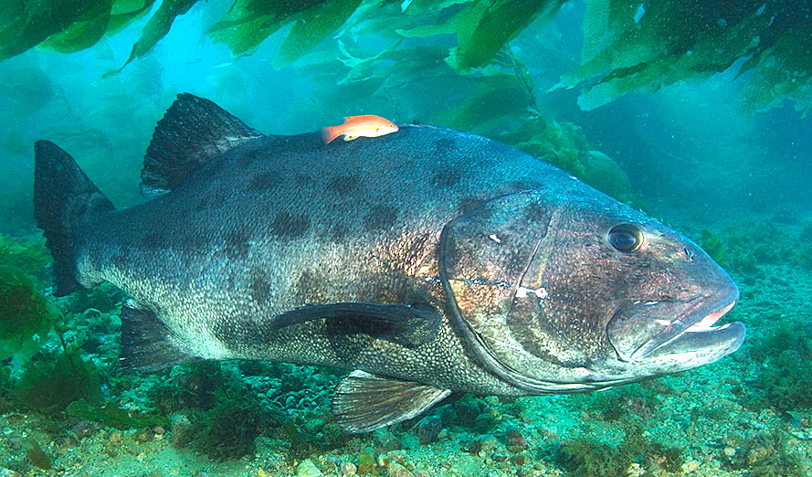

#Introduction

This lab is a (brief) introduction to Conservation Planning in R, and more generally an introduction to a few ways to visualize and analyze spatial data in R. The key word is _introduction_: this exercise should give you a taste of what I think is a very powerful and flexible software that can potentially have many applications for Conservation Planning.

***
##First things first

**Make sure you have downloaded and installed the latest versions of [R](https://cran.r-project.org/mirrors.html) and [Rstudio](https://www.rstudio.com/products/rstudio/download/).**

## Why R?

Lots of digital ink has been spilled explaining the advantages (and limitations) of R. For the purposes of this class, I would say that R has a few advantages that make it potentially useful for Conservation Planning:
  
  1. It is completely open source, meaning that anyone can download and use it (for free), _and_ anyone can contribute to it. It is a living language, meaning that it is constantly being updated and improved, and is only growing in popularity. Additionally, R's open source nature means that there are a lot of practitioners willing to help each other out with code and questions. It is an active community.
  2. R allows you to create __transparent__, __fully reproducible__ analyses, facilitating knowledge-sharing. For example, I can share this code with you, and it should (likely) run just the same for you as it does for me, allowing you to see not just my results, but exactly how I got there
  3. Going along with the above, R empowers you to write scripts and functions that be run and tweaked multiple times. No more remembering which buttons to push in ArcGIS, or writing out a workflow for MaxEnt by hand so you don't forget: If you have a functional piece of R code, and decide later that you want to tweak some parameter, or add a few steps, this is easily done if your analysis is in R.
  4. Many conservation planning tools are now implemented in R. This includes tools you are familiar with, including MaxEnt (in the 'dismo' package, which stands for distribution modeling), Marxan, Circuitscape, and other newer tools like Prioritzr, that is similar to Marxan but is fully optimized and much faster.
  
  
Right off the bat, I want to point you to some interesting and useful CP and R resources:
  
  * Chris Brown, a researcher at the [Australian Rivers Institute](https://www.griffith.edu.au/environment-planning-architecture/australian-rivers-institute), has a [blog](http://www.seascapemodels.org/Rstats/index.html#page_content) with some great examples of R code used in conservation planning purposes
  * The [National Center for Ecological Analysis and Synthesis](https://www.nceas.ucsb.edu/), or NCEAS, right here in our own backyard, always has a number of existing, data-driven projects going, and many of their scientists and staff work in R on spatial analysis and/or conservation planning. You can find many of their helpful R tutorials [here](https://www.nceas.ucsb.edu/scicomp/software/r). This lab is a direct adaptation of an NCEAS tutorial by Jamie Afflerbach.
  * Googling! As an open source platform with hundreds of thousands of practitioners, R has a large and active community. Googling around can be a great way to get answers to your questions
  * Many R packages (the cohesive collections of functions that can be written by anyone, and form the guts of R's functionality) come with extensive help files, tutorials, and examples, sometimes called `vignette`. If you want to know what a package or function does, typing `?` followed by the function or package name (e.g. `?raster`) is always a good place to start!
  
***
#Research Questions
  
We will be utilizing some data from our previous lab on hotspots in the California Current to produce some threat layers of interest. This will be a two part lab. In the first, we will look at compiling different categories of threats, like the authors did in [Halpern et al. (2009)](http://onlinelibrary.wiley.com/doi/10.1111/j.1755-263X.2009.00058.x/full). The guiding research questions are:

  **1. What are the spatial mismatches of local vs. global threats in the CA Current?**
  
  **2. (for week 2 of the lab) Where were MPAs placed? Which threats do they address?**



#Part 1: Setup

In the first part of the lab, we'll be working with raster data. As a reminder, raster or **gridded** data are stored as a grid of values which are rendered on a map as pixels.

```{r ,echo=FALSE}
library(png)
library(grid)
img <- readPNG('images/raster_concept.png')
 grid.raster(img)
rm(img)
```

##Examples

Some examples of raster data include oceanographic datasets such as Sea Surface Temperature, land use maps and digital elevation maps, and of course, our California Current threat data.

```{r ,echo=FALSE}
img <- readPNG('images/examples.png')
 grid.raster(img)
rm(img)
```

See a great intro to raster data in R **[here](http://neondataskills.org/R/Introduction-to-Raster-Data-In-R/)**

##GeoTIFFs

Raster data can come in many different formats. In this lab, we us geotiff data which has the extension `.tif`. A `.tif` file stores metadata or attributes about the file as embedded tif tags. These tags can include the following raster metadata:

  1. A Coordinate Reference System (`CRS`)
  2. Spatial Extent (`extent`)
  3. Values that represent missing data (`NoDataValue`)
  4. The `resolution` of the data

##Libraries & Settings

There are a lot of spatial packages for R, we will touch on some of them here but not all of them. Here is brief overview, taken from [this site](http://geoawesomeness.com/r-goes-spatial/):  

* **raster:** Reading, writing, manipulating, analyzing and modeling of gridded spatial data  
* **rgdal:** Provides the most important and basic spatial functionalities. Provides bindings to Frank Warmerdam’s Geospatial Data Abstraction Library (GDAL) (>= 1.6.3, < 2) and access to projection/transformation operations from the PROJ.4 library   
* **sp:** provides classes and functions for spatial data   
* **rgeos:** Provides spatial vector operations like buffer and intersect. Interface to Geometry Engine – Open Source (GEOS) using the C API for topology operations on geometries.  
* **maps**: This package has pre-loaded maps stored which can be added to your map plots. 
* **maptools:** tools for reading and writing spatial data (visualisation)

```{r libraries,message=F}
# if need be, you can install the packages you don't have with the command install.packages(), 
# with the package names in quotes:
# install.packages("raster","rgdal","rasterVis","maps","rgeos","dplyr","RColorBrewer")

# Load the libraries into this R session
library(raster)       #Main raster library with nearly all functions used in this analysis
library(rgdal)        #Spatial library - most functions used from rgdal are for vectors (shapefiles)
library(rasterVis)    #Useful for raster visualizations
library(maps)         #Has a database of maps. I use this to add a map to my raster to visualize land boundaries
library(rgeos)        #Need this library for topology operations on geometries
library(dplyr)        #NOT spatial - this is a data wrangling library
library(RColorBrewer) #Also not spatial - used to set the spectral color scheme 

``` 

Now, we should be ready to actually begin looking at data!

***

#Part 2: Importing Raster Data

For the first part of this lab, we will re-do the hotspot analysis from Week 3, to show how analyses in R are directly comparable to (and in my opinion, easier!) those done in other programs like ArcGIS.

Colors are important for digestible visualization in R, just like in ArcMap or any other software. I don't particularly like the default color scheme in R, so here we set up our own.

```{r settings}
# rainbow color scheme
cols = rev(colorRampPalette(brewer.pal(11, 'Spectral'))(255)) 

#setting smaller margins for plotting
par(mar=c(2,2,1,1))
```

## Read in Raster Data  

We now read some raster data into R. We have to make sure we let R know where to find the data:

```{r threats,results='hide'}
threats_dir <- 'E:/TA files/CP2017_Owen/R lab development/Threats_data' # Directory where all my files are. THIS WILL BE DIFFERENT FOR YOU
threat_files <- list.files(threats_dir,full.names = T) # List the files in this folder
threat_files # print the file names into the console
```

Let's import the raster with the cumulative threat layer. Create a raster of the first file by calling `raster()` (think of this function like `read.csv()` for raster data, if you are familiar with that function).

```{r all threats import}
all_threats <- raster(threat_files[2])
```

## Visualize
We can then use `plot()` to plot the raster; it's that easy! To override the default color scheme, we define the argument `col=` as our own scheme `cols` from above.

```{r all threats plot}
plot(all_threats,col=cols)
```

We can add a basemap to our raster by utilizing the `maps` package

```{r basemap}
# add a landmap to your shapefile. the add=T argument tells R to add it to the existing plot.
# make sure you understand what the other arguments do
plot(all_threats,ext=extent(-130,-110,24,50),col=cols)
map('world',fill=T,add=T,col='gray')
```

##Extent and Zoom

Visualizing exploring rasters in different ways can give us a great idea of our data, without even running much analysis. You can visualize a different extent, or subset, of the data:

```{r extent}
plot(all_threats,col=cols,ext=extent(-121,-117,32,35),main="Cumulative Threats") # A good extent for the Santa Barbara Channel
```

The `zoom()` function, by default, allows you to draw your own extent just by clicking twice.

```{r zoom}
plot(all_threats,col=cols)
# zoom(all_threats,col=cols) #Interactive code not run in html
```

__*QUESTION: Which part of the SF Bay area is at highest threat?*__

***

##Raster data attributes

Beyond visualization, we can also look at some simple characteristics of the data itself. Just calling the name of our raster will give us some information:

```{r data atts}
all_threats
```

__*QUESTION: What is the minimum value of all raster cells in our threats layer?*__

We can look at the frequency histogram of raster cell values. 
```{r hist,warning=F}
hist(all_threats,main="Cumulative Threats Frequency")
```

Also, the function `cellStats()` allows us to run some basic statistics. Type `?cellStats` to read what the function can do

```{r cellStats}
cellStats(all_threats,mean)
```

__*QUESTION: What is the standard deviation of all raster cells in our threats layer?*__

```{r sd threats,include=F}
cellStats(all_threats,sd)
```

***

#Part 3: Raster Calculations

Quickly visualizing raster data in R is nice, but the real power of raster analysis is when we can perform calculations that link two or more raster layers. If you remember from our hotspots lab, our first task was to __overlay the top 20% of cumulative threats with the top 20% of species richness, to find threat hotspots__. This will require 4 steps:

  1. Import the data (already done for threats)
  2. Resample the data to the same resolution
  3. Reclassify the data to find the top 20%
  4. Overlay the data and find hotspots

##Import Species Data

The species data is in the Species data directory, and we import it just as we did the threats layer, by providing a full path name. We can then check its attributes.

```{r Species,results='hide'}
all_spp <- raster("E:/TA files/CP2017_Owen/R lab development/Species_data/ca_curr_sp_rich.tif")
all_spp
plot(all_spp,col=cols)
```

##Cropping and Resolving

If you type `all_spp` and `all_threats` (or plot them), you should be able to tell that we may run into problems trying to immediately do calculations on them, as they have different __extents__ and __resolutions__. Two helpful functions to deal with these problems are `crop()` and `resample()`.

__*QUESTION: Before doing the next step, which of our two rasters has a greater extent? a higher (finer) resolution? What does this mean about how we should resample?*__

***

###Crop

We first crop the threats layer to the extent of the species layer
```{r crop and resample}
#?crop see what the crop function does

threats_crop <- crop(all_threats,all_spp) #Crop the threats layer to the same extent at species
```

***

###Resample
Now the threats layer has the same extent as the species layer. But we have to resample the species layer such that it has the same resolution as the threats layer.

```{r resample,message=F}

#?resample see what the resample function does
# NOTE: the progress='text' argument is a great tool: it prints out the progress
# of a longer-running function into the console, so you can see how the operation is going

# the method='ngb' argument specifies that we want to use a nearest neighbor algorithm to resample, instead of interpolation
spp_res <- resample(all_spp,threats_crop,method='ngb',progress='text')
```

***

###Raster Stack
We can check that the two layers will line up decently by using the `stack()` function. `stack()` creates a `RasterStack` object, which is basically just exactly what it sounds like: A single object holding multiple raster layers. This isn't as useful for just a couple of layers, but it will likely be useful to you later on when you are combining multiple threat layers.

```{r stack}
spp_threat_stack <- stack(threats_crop,spp_res)
plot(spp_threat_stack,col=cols)
```

Even though this layers still look similar to how they did before, the fact that they stacked together means they are likely ready for combination.

##Reclassify

Remember, we want to find the top 20% of cells in each layer, and then combine the two layers to produce hotspots. We do this with the `reclassify()` function from the `raster` package. Type `?reclassify` and make sure you understand what the function does, especially the `rcl` argument.

First, let's focus on the species layer.

```{r spp hist}
hist(spp_res,main="Species Raster Values")
```

###Re-assign Zeroes
This layer has a huge number of zeroes, which, from the graph seem like they should be NAs. We can reassign zero values to `NA` by calling the reclassify function.

```{r reclass zeroes}
# notice that in the following, we are OVERWRITING the original spp_res object.
# This is okay in this instance since we won't be using the old version, but
# often it is better to assign any output of a function to a new variable or object
spp_res <- reclassify(spp_res,rcl=c(-Inf,0,NA))
hist(spp_res,main="Species Raster Values, Zeroes Removed") # did the function do what we were hoping?
```

###Reclassify Species
Next, we find the top 20% of the species data, assigning those cells a value of 1, and all the other non-NA cells a value of zero. The `quantile()` function is very useful for this.

```{r top 20 percent}
#?quantile what does the quantile function do?
spp_cutoff <- quantile(spp_res,0.8) # Find the value of the 80th percentile
spp_maxVal <- cellStats(spp_res,max) #find the maximum

# Our reclassification matrix. Make sure you know what this is saying
rcl_mat <- c(-Inf,spp_cutoff,0,
            spp_cutoff,spp_maxVal,1)

# Reclassify the species layer
spp_binary <- reclassify(spp_res,rcl=rcl_mat)
```

We can visualize the result of this reclassification just by plotting, as before:

```{r reclass plot}
# Because we have binary data now, I want to change the color scheme again
binary_cols <- c("white","firebrick")
plot(spp_binary,col=binary_cols,legend=F,main="Top 20% of Species Richness")
map('world',fill=T,add=T,col='gray')
```
***

###Reclassify Threats
Now we just do a similar process for the threats.

__*TASK: Reclassify the threats layer (make sure it is the one with the correct extent!) to assign a value of 1 to the top 20% of the cells, and a zero to the others*__

It should look something like this:

```{r threat reclass,echo=F}
#?quantile what does the quantile function do?
threat_cutoff <- quantile(threats_crop,0.8) # Find the value of the 80th percentile
threat_maxVal <- cellStats(threats_crop,max) #find the maximum

# Our reclassification matrix. Make sure you know what this is saying
rcl_mat <- c(-Inf,threat_cutoff,0,
            threat_cutoff,threat_maxVal,1)

# Reclassify the species layer
threat_binary <- reclassify(threats_crop,rcl=rcl_mat)
plot(threat_binary,col=binary_cols,legend=F,main="Top 20% of Cumulative Threats")
map('world',fill=T,add=T,col='gray')
```

##Hotspots
Now, all we have to do is overlay the two layers to find our hotspots. We do this with the `overlay()` function, which takes two or more rasters and applies a function to them, given by us in the `fun` argument. In this case, because the two rasters we are combining are just 1s and zeroes, we can just add them together! But remember for later that you can write your own function to combine rasters in other ways.

```{r hotspots}
# the hotspots
hotspots <- overlay(spp_binary,threat_binary,fun=function(x,y){x+y})

# color breakpoints. We need three colors now! (cell values of 0,1,or 2)
brks_hotspots <- seq(0,3,length.out=4) 
hotspot_cols <- c("white","lightblue","firebrick") #

# plot the hotspots!
plot(hotspots,col=hotspot_cols,legend=F,main="Hotspots");map('world',fill=T,add=T,col='gray80')
plot(hotspots,col=hotspot_cols,ext=extent(-121,-117,32,35),main="Hotspots, SB Channel",legend=F)
map('world',fill=T,add=T,col='gray80')
```

Voila! Our hotspots.

# All of the Above
This may have seemed like a lot to you. You may have been thinking "R seems much more complicated than just doing this in ArcMap". You are of course entitled to your opinion, but once you are a little bit familiar with R, I personally believe you will find it much easier and quicker than a lot of the clunkiness that comes along with ArcGIS. For example, here is all of the above code to make hotspots in less than 30 lines of code. I would argue this is MUCH faster than doing this analysis in Arc. And it is fully reproducible, (usually) throws understandable error messages if something goes wrong, and is easy to share with others and adapt to other data or purposes.

Notice that I wrote and included my own function (in this case, a function that takes a raster and a given quantile, and returns a binary raster, assigning ones and zero to those cells above or below a threshold quantile). Writing your own functions is SUPER useful in R, and if you are interested, try writing your own for the next part of this lab.

```{r all code, eval=F}
### import data ###
all_spp <- raster("E:/TA files/CP2017_Owen/R lab development/Species_data/ca_curr_sp_rich.tif")
all_threats <- raster("E:/TA files/CP2017_Owen/R lab development/Threats_data/full_modelnv.tif")

#### Crop, resample, and reclassify ###
all_spp <- reclassify(all_spp,rcl=c(-Inf,0,NA)) # reclass 0 to NA
threats_crop <- crop(all_threats,all_spp) # crop threats to species
spp_res <- resample(all_spp,threats_crop,method='ngb') # resample species to threat's resolution

#### Function to output a binary raster based on a user-given quantile (default is top 20%) ###
reclassify_topx <- function(rast,quant=0.8) {
  topx <- quantile(rast,quant) #find the 80% quantile of the raster values
  maxVal <- cellStats(rast,max) #find the maximum
  rcl <- c(-Inf,topx,0,
            topx,maxVal,1) # reclassify matrix (see help file for ?reclassify)
  out <- reclassify(rast,rcl=rcl)
  return(out) # returns the new binary raster
}

### Find top 20%, using the code from above. We could easily choose a different quantile here. ###
all_threats_top20 <- reclassify_topx(threats_crop,quant=0.8)
all_spp_top20 <- reclassify_topx(spp_res,quant=0.8)

### overlay and plot the hotspots ###
hotspots <- overlay(all_threats_top20,all_spp_top20,fun=function(x,y){x+y})
brks_hotspots <- seq(0,3,length.out=4) # color breakpoints
hotspot_cols <- c("white","lightblue","firebrick") # colors
plot(hotspots,col=hotspot_cols);map('world',fill=T,add=T,col='gray80')
```

#Your Turn

The above showed you some of the basics of raster analysis in R. Now it's your turn to apply these tools to a related spatial analysis problem. If you remember, our guiding question for this week was:

**What are the spatial mismatches of local vs. global threats in the CA Current?**

Using the table below, choose a set of threat layers (Climate, Fishing, Land-Based, or Other), and:

  1. Download the appropriate set of rasters (see Table) and load them into R.
  
  2. Stack the layers and plot them (HINT: if you use the `stack` function, then you can just call `plot` once and it will plot all of the layers)
  
  3. Get an idea of the distribution of the data using `hist()`, `cellStats()`, or visually by zooming in to different sections of your rasters.
  
  4. Overlay the rasters and perform raster calculations (`reclassify`, `overlay`, maybe `calc`) to create a cumulative threat layer. You may do this however you deem appropriate. Some suggestions:
    
    * A quantile and sum approach, analagous to the above analysis
    * A mean threat value per raster cell
    * A maximum threat value per raster cell
    * A _weighted_ mean

There are many ways to perform these analyses. It may be helpful to outline your analysis by hand or with commented lines (`##`) before you begin, so you have a clear idea of the steps involved. If you run into errors with certain functions, make sure to read the help files first (e.g., `?overlay`), which may give you an idea of what went wrong.

```{r threats table,echo=F}
library(knitr)
layer_names <- c("impact_acid","impact_uv","impact_sst","impact_rec_fish","impact_dem_nd_hb","impact_dem_nd_lb","impact_pel_hb","impact_pel_lb","impact_dem_d","impact_nutrients","impact_sed_decrease","impact_sed_increase","impact_organic","impact_inorganic","impact_coastal_e","impact_beach_a","impact_light_pol","impact_pplants","impact_dep_ocean","impact_trash","impact_pollution","impact_shipping","impact_pens","impact_invasives","impact_oil")

descriptions <- c("Climate change: ocean acidification",
"Climate change: sea temp. change",
"Climate change: UV change",
"Fishing: recreational",
"Fishing: demrs. non-des. high bycatch",
"Fishing: demrs. non-des. low bycatch",
"Fishing: pelagic high bycatch",
"Fishing: pelagic low bycatch",
"Fishing: demersal destructive",
"Nutrient input",
"Sediment input: decrease",
"Sediment input: increase",
"Pollution input: organic",
"Pollution input: inorganic",
"Coastal engineer.: habitat alteration",
"Direct human impact: beach trampling",
"Pollution input: light/noise",
"Power, desalination plants",
"Pollution input: atmospheric",
"Ocean dumping: marine debris",
"Ocean pollution (from ships/ports)",
"Shipping (commercial, cruise, ferry)",
"Aquaculture: finfish (predators)",
"Invasive species (from ballast, etc.)",
"Benthic structures (e.g. oil rigs)"
)

categories <- c(rep("Climate",3),rep("Fishing",6),rep("Land-Based",10),rep("Other",6))
threats_table <- cbind(layer_names,descriptions,categories)
kable(threats_table,col.names=c("File Name","Description","Threat Category"))
```

